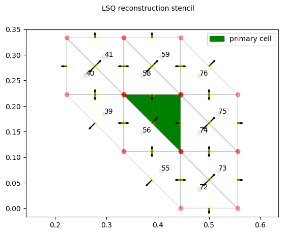

# PyCFD

Some aspects of computational fluid dynamics, prototyped in Python

# Requirements

1. NumPy
2. matplotlib
3. weakref

# Optional
1. memory_profiler (optional)

# Some implementation details pictured

