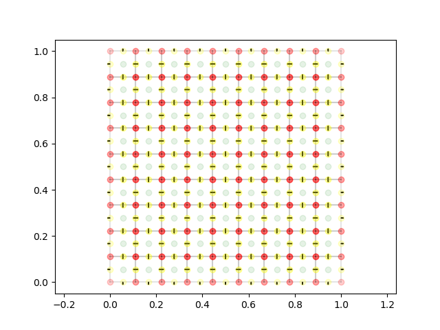
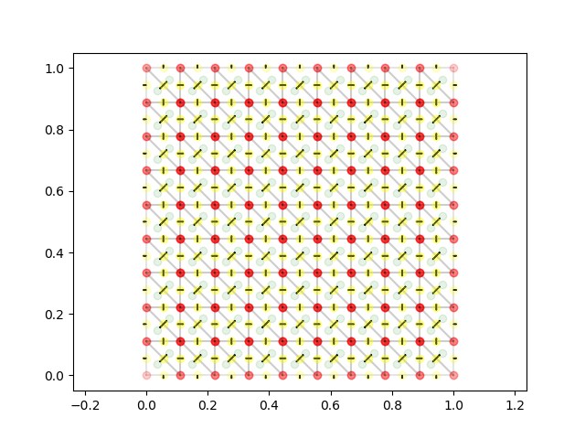

# PyCFD

An unstructured solver for the Euler equations on a 2D grid, prototyped in Python.

1. LSQ gradient reconstruction
2. Roe approximate Riemmann solver for the flux 
3. Cell centered.
4. Tri and quad meshes shown

# Requirements

1. NumPy
2. matplotlib
3. weakref

# Optional
1. memory_profile

# Some implementation details pictured

# Cartesian mesh

Normals, centroids, face centers, edges, and vertices shown.

# Tri mesh

Normals, centroids, face centers, edges, and vertices shown.

# Testing

The implemenatation is not yet finished.  Right now, I am working through the explicit Euler solver (Runge Kutta time stepping at the moment)  You can run the "solver.py" file directly and make pictures of LSQ stencils around any cell.  You can also run the "System2D.py" file (sorry for stupid naming) and get plots showing small tri and quad grids, generated in a structured fashion, but used as if they were fully unstructured.  This is by design.  The point of this exercise is to go through the motions of implementing an unstructrued Euler solver before "doing the real thing" in C++.  At any rate, this code should have utility in showing how things fit together.  

Cheers,

Luke
