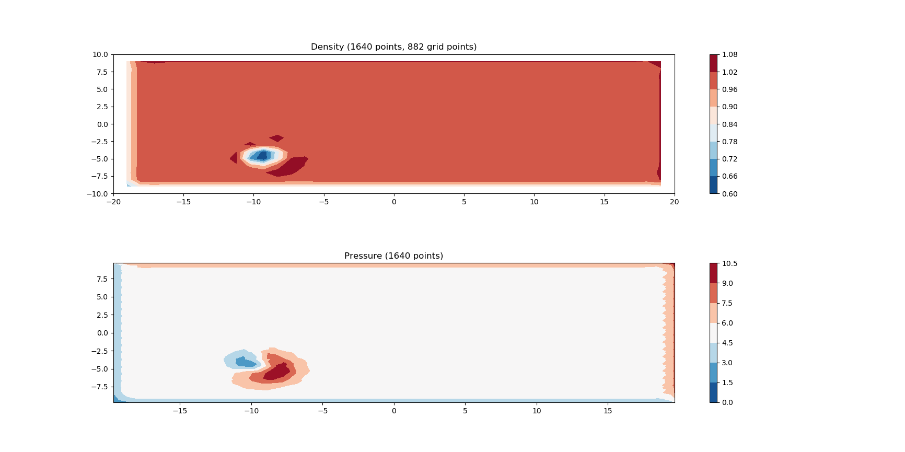

# PyCFD

An unstructured solver for the Euler equations on a 2D grid, prototyped in Python.

1. LSQ gradient reconstruction
2. Roe approximate Riemmann solver for the flux 
3. Cell centered.
4. Tri and quad meshes shown

# Requirements

1. NumPy
2. matplotlib
3. weakref

# Optional
1. memory_profile
2. paraview for viewing vtk output files

# Unstructured mesh physics reconstruction

# Testing

The implemenatation is pretty well finished, but I am expanding it.  Right now, the explicity steady solver is known to work well for the cylinder and airfoil test cases.  You can also run the "System2D.py" file and get plots showing small tri and quad grids.  The solver treats all meshes as unstructured by design.  The point of this exercise is to go through the motions of implementing an unstructrued Euler solver before "doing the real thing" in C++.  

Here are some shock diffraction (supersonic flow over a backward facing step) plots made with the solver:

And here's a sample result of flow over an airfoil:

Update:  need to update the initial vortex:

Here are plots of density and pressure, done with two different methods of interpolating unstructured data to a cartesian grid for plotting.  Not sure which is better just yet.

Hmm... That was for a tri-mesh.  Here is the same on a quad mesh:

# Basic Mesh Plots in Python

# # Quad Mesh

Normals, centroids, face centers, edges, and vertices shown.

# # Tri mesh

Normals, centroids, face centers, edges, and vertices shown.

## PyCFD Repository Overview

A quick, markdown-formatted, chatgpt assisted tour of each part of the codebase:

---

### Top-level files & folders

- **`README.md`**  
  Project overview, requirements, sample results & plots.

- **`LICENSE`**  
  MIT license text.

- **`.gitignore`**  
  Git ignore rules.

- **`cases/`**  
  Sample mesh/case definitions (e.g., airfoil, cylinder).

- **`notes/`**  
  Development notes and TODOs.

- **`output/vtk/`**  
  VTK files (e.g. `.vtu`) written by the solver for ParaView.

- **`pics/`**  
  PNGs used in the README to illustrate results.

---

### `src/` — Core solver code

- **`getPaths.py`**  
  Utility to locate your `cases`, `output`, etc., in a portable way.

- **`input.nml`**  
  Namelist of simulation parameters (time step, CFL, thresholds, file names).

- **`Parameters.py`**  
  Parser that reads `input.nml` into structured Python parameters.

- **`Element.py`**  
  Defines per-element data (triangle/quad primitives, face connectivity).

- **`System2D.py`**  
  The mesh classes (`Grid`, `Node`, `Cell`) plus routines to build incidence maps, centroids, normals.

- **`Math2D.py`**  
  2D geometric utilities (area, centroid, vector operations).

- **`Overload.py`**  
  Operator overloads (e.g. vector arithmetic).

- **`Utilities.py`**  
  Miscellaneous helpers (e.g. logging, timing).

- **`FileTools.py`**  
  File I/O helpers (e.g. directory creation, file copying).

- **`DataHandler.py`**  
  Read/write mesh and flow-field data (VTK, CSV, etc.).

- **`InitialConditions.py`**  
  Preset flow fields (vortex, backward-facing-step, etc.).

- **`BoundaryConditions.py`**  
  Enforcement of wall, inlet, outlet, symmetry BCs.

- **`1DRiemann.py`** / **`2DRiemann.py`**  
  1D and 2D Riemann solvers for Euler fluxes (Roe approximate).

- **`flux.py`**  
  Higher-level flux wrappers that call your Riemann solvers.

- **`ManufacturedSolutions.py`**  
  Tools to generate or verify against analytic “manufactured” solutions.

- **`PlotGrids.py`**  
  Mesh-plotting routines (tri/quad, centroids, normals).

- **`Solvers.py`**  
  Spatial discretization: finite-volume stencils, residual assembly.

- **`Integrator.py`**  
  Time stepping (explicit RK methods, CFL control).

- **`Debugging.py`**  
  Helper functions for introspecting/debugging mesh & fields.

- **`simple_code1.py`**  
  Minimal demo script showing basic solver usage (good for quick smoke tests).
  
- **`amr.py`** 
  Adaptive mesh refinement module that will hook into `System2D.py`’s mesh structures, 
  using the existing LSQ stencil routines to drive adaptive refinement.

---

Cheers,

Luke
